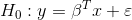

<!-- README.md is generated from README.Rmd. Please edit that file -->

```{r, include = FALSE}
knitr::opts_chunk$set(
  collapse = TRUE,
  comment = "#>",
  fig.path = "man/figures/README-",
  out.width = "70%"
)
```
# lineartestr

<!-- badges: start -->

[](https://GitHub.com/FedericoGarza/lineartestr/commits)
[](https://lbesson.mit-license.org/)

<!-- badges: end -->

The goal of `lineartestr` is to contrast the linear hypothesis of a model:





Using the Domínguez-Lobato test which relies on wild-bootstrap. Also the Ramsey RESET test is implemented.

## Installation

You can install (soon) the released version of `lineartestr` from [CRAN](https://CRAN.R-project.org) with:

``` r
install.packages("lineartestr")
```

And the development version from [GitHub](https://github.com/) with:

``` r
# install.packages("devtools")
devtools::install_github("FedericoGarza/lineartestr")
```
## Examples

### Simplest linear models using `lm` function

```{r example}
library(lineartestr)

x <- 1:100
y <- 1:100

lm_model <- lm(y~x)

dl_test <- dominguez_lobato_test(lm_model)

```

```{r table}
dplyr::glimpse(dl_test$test)
```

Also `lineartestr` can plot the results

```{r plot}
plot_dl_test(dl_test)
```

#### Run in **parallel**!

```{r example_parallel}
library(lineartestr)
x_p <- 1:1e5
y_p <- 1:1e5

lm_model_p <- lm(y_p~x_p)

dl_test_p <- dominguez_lobato_test(lm_model_p, n_cores=7)

```

```{r table2}
dplyr::glimpse(dl_test_p$test)
```

#### *RESET* test can also be used to test the linear hypothesis

```{r example_reset}
library(lineartestr)

x <- 1:100 + rnorm(100)
y <- 1:100

lm_model <- lm(y~x)

r_test <- reset_test(lm_model)

```

```{r table_reset}
dplyr::glimpse(r_test)
```

An then we can plot the results

```{r plot_reset}
plot_reset_test(r_test)
```

### Linear fixed effects with [`lfe`](https://cran.r-project.org/web/packages/lfe/lfe.pdf)

```{r example_lfe}
library(lineartestr)
library(dplyr)
library(lfe)

# This example was taken from https://www.rdocumentation.org/packages/lfe/versions/2.8-5/topics/felm
x <- rnorm(1000)
x2 <- rnorm(length(x))
# Individuals and firms
id <- factor(sample(20,length(x),replace=TRUE))
firm <- factor(sample(13,length(x),replace=TRUE))
# Effects for them
id.eff <- rnorm(nlevels(id))
firm.eff <- rnorm(nlevels(firm))
# Left hand side
u <- rnorm(length(x))
y <- x + 0.5*x2 + id.eff[id] + firm.eff[firm] + u
new_y <- y + rnorm(length(y))
## Estimate the model 
est <- lfe::felm(y ~ x + x2 | id + firm)


## Testing the linear hypothesis and plotting results
dominguez_lobato_test(est, n_cores = 7) %>% 
  plot_dl_test()
```

### ARMA models

```{r example_arma}
library(lineartestr)
library(dplyr)

x <- rnorm(100)**3

arma_model <- forecast::Arima(x, order = c(1, 0, 1))

dominguez_lobato_test(arma_model) %>% 
  plot_dl_test()
```


## References

* Manuel A. Domínguez and Ignacio N. Lobato (2019). [Specification testing with estimated variables.](https://www.tandfonline.com/doi/citedby/10.1080/07474938.2019.1687116?) Econometric Reviews.
