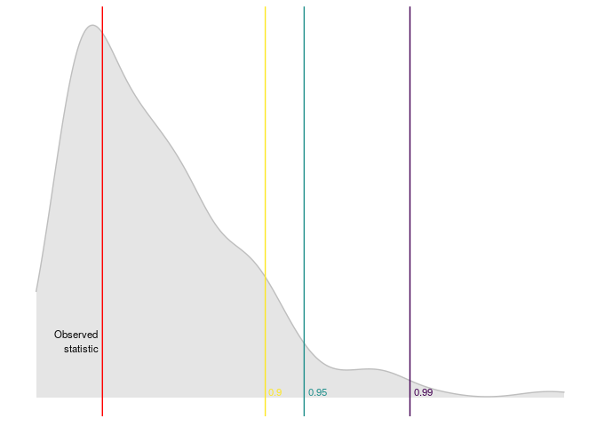
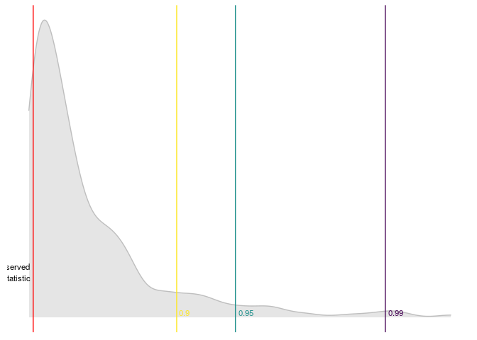

<!-- README.md is generated from README.Rmd. Please edit that file -->

# lineartestr

<!-- badges: start -->


[](https://www.gnu.org/licenses/gpl-2.0.en.html)
<!-- badges: end -->

The goal of `lineartestr` is to contrast the linear hypothesis of a
model:


Using the Domínguez-Lobato test which relies on wild-bootstrap. Also the
Ramsey RESET test is implemented.

## Installation

You can install the released version of `lineartestr` from
[CRAN](https://CRAN.R-project.org) with:

``` r
install.packages("lineartestr")
```

And the development version from [GitHub](https://github.com/) with:

``` r
# install.packages("devtools")
devtools::install_github("FedericoGarza/lineartestr")
```

## References

  - Manuel A. Domínguez and Ignacio N. Lobato (2019). [*Specification
    testing with estimated
    variables.*](https://www.tandfonline.com/doi/citedby/10.1080/07474938.2019.1687116?)
    Econometric Reviews.

## Cite as

  - Garza F (2020). *lineartestr: Test the linear specification of a
    model*. R package version 1.0.0,
    <https://github.com/FedericoGarza/lineartestr>.

## Examples

### Simplest linear models using `lm` function

``` r
library(lineartestr)

x <- 1:100
y <- 1:100

lm_model <- lm(y~x)

dl_test <- dominguez_lobato_test(lm_model)
```

``` r
dplyr::glimpse(dl_test$test)
#> Observations: 1
#> Variables: 7
#> $ name_distribution <chr> "rnorm"
#> $ name_statistic    <chr> "cvm_value"
#> $ statistic         <dbl> 7.562182e-29
#> $ p_value           <dbl> 0.3766667
#> $ quantile_90       <dbl> 2.283939e-28
#> $ quantile_95       <dbl> 3.239602e-28
#> $ quantile_99       <dbl> 5.20654e-28
```

Also `lineartestr` can plot the results

``` r
plot_dl_test(dl_test)
```


#### Run in **parallel**\!

``` r
library(lineartestr)
x_p <- 1:1e5
y_p <- 1:1e5

lm_model_p <- lm(y_p~x_p)

dl_test_p <- dominguez_lobato_test(lm_model_p, n_cores=7)
```

``` r
dplyr::glimpse(dl_test_p$test)
#> Observations: 1
#> Variables: 7
#> $ name_distribution <chr> "rnorm"
#> $ name_statistic    <chr> "cvm_value"
#> $ statistic         <dbl> 6.324343e-21
#> $ p_value           <dbl> 0.34
#> $ quantile_90       <dbl> 2.059126e-20
#> $ quantile_95       <dbl> 2.425963e-20
#> $ quantile_99       <dbl> 4.429028e-20
```

#### *RESET* test can also be used to test the linear hypothesis

``` r
library(lineartestr)

x <- 1:100 + rnorm(100)
y <- 1:100

lm_model <- lm(y~x)

r_test <- reset_test(lm_model)
```

``` r
dplyr::glimpse(r_test)
#> Observations: 1
#> Variables: 6
#> $ statistic   <dbl> 5.07063
#> $ p_value     <dbl> 0.07923674
#> $ df          <int> 2
#> $ quantile_90 <dbl> 4.60517
#> $ quantile_95 <dbl> 5.991465
#> $ quantile_99 <dbl> 9.21034
```

An then we can plot the
results

``` r
plot_reset_test(r_test)
```


### Linear fixed effects with [`lfe`](https://CRAN.R-project.org/web/packages/lfe/lfe.pdf)

``` r
library(lineartestr)
library(dplyr)
#> 
#> Attaching package: 'dplyr'
#> The following objects are masked from 'package:stats':
#> 
#>     filter, lag
#> The following objects are masked from 'package:base':
#> 
#>     intersect, setdiff, setequal, union
library(lfe)
#> Loading required package: Matrix

# This example was taken from https://www.rdocumentation.org/packages/lfe/versions/2.8-5/topics/felm
x <- rnorm(1000)
x2 <- rnorm(length(x))
# Individuals and firms
id <- factor(sample(20,length(x),replace=TRUE))
firm <- factor(sample(13,length(x),replace=TRUE))
# Effects for them
id.eff <- rnorm(nlevels(id))
firm.eff <- rnorm(nlevels(firm))
# Left hand side
u <- rnorm(length(x))
y <- x + 0.5*x2 + id.eff[id] + firm.eff[firm] + u
new_y <- y + rnorm(length(y))
## Estimate the model
est <- lfe::felm(y ~ x + x2 | id + firm)


## Testing the linear hypothesis and plotting results
dominguez_lobato_test(est, n_cores = 7) %>%
  plot_dl_test()
```



### ARMA models

``` r
library(lineartestr)
library(dplyr)

x <- rnorm(100)**3

arma_model <- forecast::Arima(x, order = c(1, 0, 1))
#> Registered S3 method overwritten by 'xts':
#>   method     from
#>   as.zoo.xts zoo
#> Registered S3 method overwritten by 'quantmod':
#>   method            from
#>   as.zoo.data.frame zoo
#> Registered S3 methods overwritten by 'forecast':
#>   method             from    
#>   fitted.fracdiff    fracdiff
#>   residuals.fracdiff fracdiff

dominguez_lobato_test(arma_model) %>%
  plot_dl_test()
```


