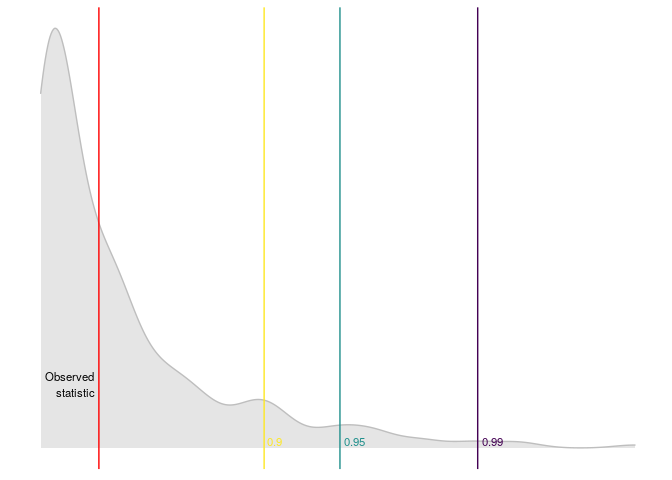

<!-- README.md is generated from README.Rmd. Please edit that file -->

# linearspectestr

<!-- badges: start -->

[](https://GitHub.com/FedericoGarza/linearspectestr/commit-activity)
[](https://lbesson.mit-license.org/)

<!-- badges: end -->

The goal of `linearspectestr` is to contrast the linear hypothesis of a
model:


Using the Domínguez-Lobato test which relies on wild-bootstrap.

## Installation

You can install (soon) the released version of `linearspectestr` from
[CRAN](https://CRAN.R-project.org) with:

``` r
install.packages("linearspectestr")
```

And the development version from [GitHub](https://github.com/) with:

``` r
# install.packages("devtools")
devtools::install_github("FedericoGarza/linearspectestr")
```

## Example

``` r
library(linearspectestr)

x <- 1:100
y <- 1:100

lm_model <- lm(y~x)

dl_test <- dominguez_lobato_test(lm_model)
```

``` r
dplyr::glimpse(dl_test$test)
#> Observations: 1
#> Variables: 7
#> $ name_distribution <chr> "rnorm"
#> $ name_statistic    <chr> "cvm_value"
#> $ statistic         <dbl> 7.562182e-29
#> $ p_value           <dbl> 0.39
#> $ quantile_90       <dbl> 3.009221e-28
#> $ quantile_95       <dbl> 4.045725e-28
#> $ quantile_99       <dbl> 5.720393e-28
```

Also `linearspectestr` can plot the results

``` r
plot_dl_test(dl_test)
```



RUN IN PARALLEL\!

``` r
library(linearspectestr)
x_p <- 1:1e5
y_p <- 1:1e5

lm_model_p <- lm(y_p~x_p)

dl_test_p <- dominguez_lobato_test(lm_model_p, n_cores=7)
```

``` r
dplyr::glimpse(dl_test_p$test)
#> Observations: 1
#> Variables: 7
#> $ name_distribution <chr> "rnorm"
#> $ name_statistic    <chr> "cvm_value"
#> $ statistic         <dbl> 6.324343e-21
#> $ p_value           <dbl> 0.3533333
#> $ quantile_90       <dbl> 1.888409e-20
#> $ quantile_95       <dbl> 2.714834e-20
#> $ quantile_99       <dbl> 5.507548e-20
```

## References

  - Manuel A. Domínguez and Ignacio N. Lobato (2019). [Specification
    testing with estimated
    variables.](\(https://www.tandfonline.com/doi/citedby/10.1080/07474938.2019.1687116?scroll=top&needAccess=true\))
    Econometric Reviews.
